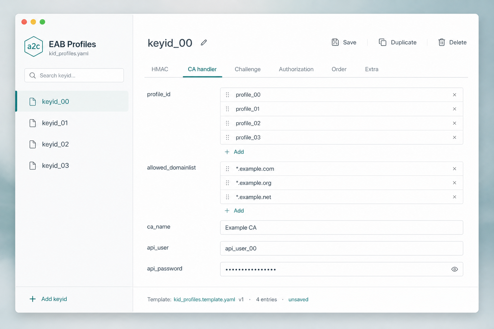
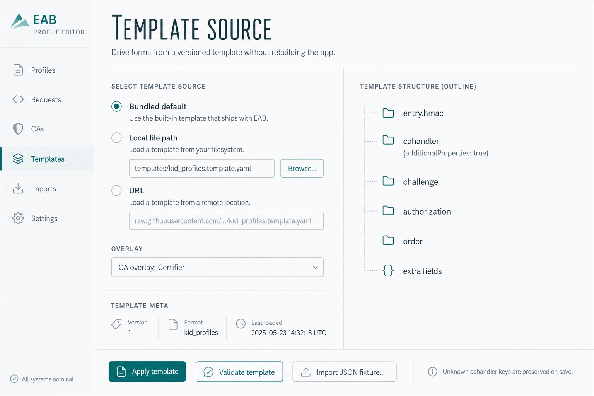

# a2c EAB Profile Editor

Desktop helper to create and maintain **YAML** enrollment profile files for [acme2certifier](https://github.com/grindsa/acme2certifier) **EAB profiling** (`kid_profile_handler` / `key_file`).

> **Status:** v1 editor usable — see **[AGENTS.md](./AGENTS.md)** for remaining release checklist.

## Why

`kid_profiles` YAML/JSON maps an EAB `keyid` to HMAC material and optional per-account overrides (`cahandler`, `challenge`, `authorization`, …). Hand-editing grows error-prone as CA handlers add fields. This app provides a modern CRUD UI driven by a **versioned template file** so the form model can change without rewriting the UI.

Upstream docs: [Enrollment profiling via EAB](https://github.com/grindsa/acme2certifier/blob/master/docs/eab_profiling.md).

## Stack

- **Tauri 2** + **SvelteKit** (static SPA) + TypeScript
- Cool-gray / teal utility UI (CSS variables; shadcn-style controls)
- Zod + template YAML + CodeMirror 6
- Vitest / Playwright
- GitHub Actions CI (unit + e2e); Tauri release matrix planned

## Mockups

| Screen | Preview |
|--------|---------|
| Main editor |  |
| Authorization + YAML |  |
| Template source |  |
| Subject + extras |  |

## Layout

```text
a2c-eab-profile-editor/
  AGENTS.md
  docs/mockups/
  templates/                # UI template + CA overlays
  fixtures/                 # example YAML/JSON
  src/                      # SvelteKit SPA
  src-tauri/                # Tauri 2 shell
  e2e/                      # Playwright smoke
  .github/workflows/ci.yml
```

## Local development

**Prereqs:** Node.js 20+, Rust (`rustc` / `cargo`), and on macOS Xcode CLT.

```bash
cd a2c-eab-profile-editor
npm install
npm run tauri:dev    # Vite + native Tauri window
# or: npm run dev    # browser-only UI on http://localhost:1420
```

In the window: **New / Open / Save / Save As / Import JSON**, or **Load example**. Browser mode uses the file picker and downloads for save.

### Tests

```bash
npm test             # Vitest (IO, template merge, HMAC)
npm run build && npm run test:e2e   # Playwright smoke against preview
npm run check        # svelte-check
```

### Desktop release

Push a version tag to run [`.github/workflows/release.yml`](.github/workflows/release.yml). That builds macOS (arm64 + Intel), Linux, and Windows installers and **publishes them on the GitHub Releases page**.

```bash
git tag v0.3.0
git push origin v0.3.0
```

To rebuild an existing tag: **Actions → Release → Run workflow** and enter the tag (for example `v0.1.0`).

Local package on the current OS only:

```bash
npm run tauri:build
# artifacts under src-tauri/target/release/bundle/
```

## Separate repository

This directory is staged inside `acme2certifier` until a dedicated GitHub repo is created (automation token lacked `createRepository`). See **Repo hosting note** in `AGENTS.md`.

## License

Align with acme2certifier (GPL-3.0) unless the standalone repo maintainers choose otherwise before first release.
